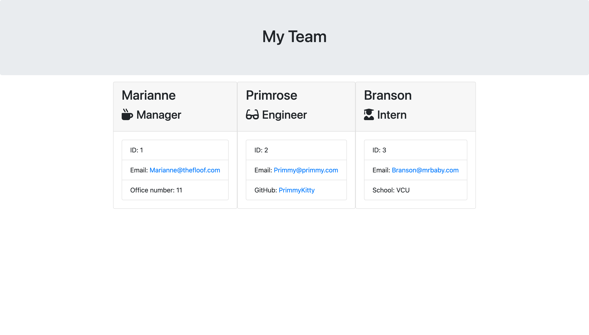

# Team Profile Generator

## Table of Contents

- [Mock-up](#mock-up)
- [Description](#description)
- [Usage](#usage)
- [User-Story](#user-story)
- [Credit](#credit)

## Mock-up

The following a video file, sample html and screenshot of what is expected of the application: <br/>
[Deployed Application Sample](https://drive.google.com/drive/folders/1VitLD9x-2aWELJl4Qnyb-4-ZjulS4ASK)


## Description

This application creates an HTML file of company's team of Employees. 

## Usage

This particular project was the 10th homework assignment in my Georgia Tech coding bootcamp, created to generate HTMl files, and to exercise understanding of the following:

- utilizing jest and inquirer and node
- running tests
- using classes in JS

## User-Story

```md
AS A manager
I WANT to generate a webpage that displays my team's basic info
SO THAT I have quick access to their emails and GitHub profiles
```
```
GIVEN a command-line application that accepts user input
WHEN I am prompted for my team members and their information
THEN an HTML file is generated that displays a nicely formatted team roster based on user input
WHEN I click on an email address in the HTML
THEN my default email program opens and populates the TO field of the email with the address
WHEN I click on the GitHub username
THEN that GitHub profile opens in a new tab
WHEN I start the application
THEN I am prompted to enter the team manager’s name, employee ID, email address, and office number
WHEN I enter the team manager’s name, employee ID, email address, and office number
THEN I am presented with a menu with the option to add an engineer or an intern or to finish building my team
WHEN I select the engineer option
THEN I am prompted to enter the engineer’s name, ID, email, and GitHub username, and I am taken back to the menu
WHEN I select the intern option
THEN I am prompted to enter the intern’s name, ID, email, and school, and I am taken back to the menu
WHEN I decide to finish building my team
THEN I exit the application, and the HTML is generated
```
## Credit
This assignment was created to demonstrate further understanding of the subject matter in collaboration with myself and our instructor, Trey Eckels